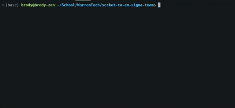
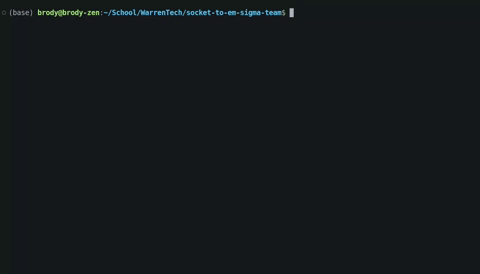

[](https://classroom.github.com/a/nSbtKKg7)
[](https://classroom.github.com/open-in-codespaces?assignment_repo_id=18294275)

# Socket-to-em Chat Application

## Project Overview

Socket-to-em is a real-time chat application built with Python that enables users to communicate through a client-server architecture. The application features a modern dark-themed GUI and supports multiple concurrent users.

This project demonstrates practical networking concepts including socket programming, multithreading, and GUI development with Tkinter.

## Technical Information

### Technologies Used
- **Python 3.x**: Core programming language
- **Socket API**: For network communication
- **Threading**: For concurrent operations
- **Tkinter**: For the graphical user interface
- **ipaddress**: For IP address validation

### Architecture
The application follows a client-server model:
- **Server (`init_server.py`)**: Manages connections, broadcasts messages to all clients
- **Client (`init_client.py`)**: Connects to server, sends/receives messages through GUI

## Installation & Setup

### Prerequisites
- Python 3.6 or higher
- Required Python packages (all included in standard library):
  - socket
  - ipaddress
  - sys
  - threading
  - tkinter
  - datetime

### Running the Server
1. Open a terminal and navigate to the project directory
2. Launch the server:
```bash
python3 init_server.py
```
3. Enter the desired host IP address (or leave blank for localhost)
4. Enter the desired port number
5. Follow the on-screen prompts to configure the server

### Running the Client
1. Open a terminal and navigate to the project directory
2. Launch the client:
```bash
python3 init_client.py
```
3. Enter the server's IP address (or leave blank for localhost)
4. Enter the server's port number
5. Choose a username (max 16 characters)

### Launching the Server



### Connecting to the Server



## Usage Guide

### Connecting to the Chat
1. Start the server first, note the IP and port
2. Launch the client and enter the connection details
3. After successful connection, the chat interface will appear

### Using the Chat Interface
- **Sending Messages**: Type in the text field at the bottom and press Enter
- **Viewing Messages**: All messages appear in the main chat area with timestamps
- **System Notifications**: Join/leave events appear with a "[System]" prefix
- **Disconnecting**: Click the "Disconnect" button or close the window

## Features & Functionality

### Key Features
- **Real-time Messaging**: Instant message delivery between clients
- **User Presence Notifications**: System messages when users join or leave
- **Dark-themed UI**: Modern, eye-friendly interface
- **Input Validation**: Ensures valid IP addresses and port numbers
- **Connection Status**: Visual indicators of connection state
- **Error Handling**: Graceful error management with user feedback

### Chat Protocol
The application implements a simple messaging protocol:
- Regular messages: `username: message content`
- Join notifications: `JOIN:username`
- Leave notifications: `LEAVE:username`

## Project Structure

### Key Files
- **`init_server.py`**: Server implementation that manages connections and broadcasts messages
- **`init_client.py`**: Client implementation with connection handling and GUI

### Client Components
- **Connection Validation**: Functions to verify IP and port validity
- **ChatUI Class**: Manages the graphical interface and user interaction
- **Threading**: Background thread for receiving messages
- **Message Handling**: Functions for sending/displaying messages

### Server Components
- **Connection Management**: Handling client connections and disconnections
- **Message Broadcasting**: Distributing messages to all connected clients
- **User Tracking**: Maintaining list of active users

## Troubleshooting

### Common Issues
- **Connection Refused**: Verify the server is running and the IP/port are correct
- **Message Not Sending**: Check network connection and server status
- **UI Not Responsive**: Ensure the receive thread is running properly

### Debug Tips
- Check terminal for error messages
- Verify firewall settings allow the application's port
- Ensure all clients are using compatible protocol versions